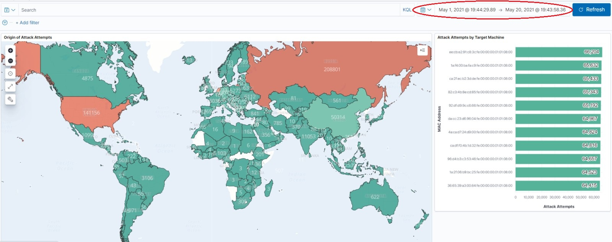

# UFW Log Files Processor
 
This project tends to provide a quick approach for collecting, processing, storing and analyzing Uncomplicated Firewall (UFW) logs.
 
## Overview
The realization of this project is based on the Elasticsearch-Logstash-Kibana (ELK) stack. For the purposes of the current implementation, setup of the ELK environment follows a quick, straightforward WindowsOS-based approach.
Anyway, setup and administration of the ELK ecosystem is a matter of deep knowledge and experience applied in each stage of the process.

## Technology Overview
The ELK Stack is a package of open source technologies for collecting, searching, analyzing, and visualizing large data volumes generated by diverse sources. 
- Elasticsearch is an open source, full-text search and analysis engine, based on the Apache Lucene search engine.
- Logstash is a log aggregator that collects data from various input sources, executes different transformations and enhancements and then ships the data to various supported output destinations.
- Kibana is a visualization layer that works on top of Elasticsearch, providing users with the ability to analyze and visualize the data.
- *Since, 2015 the ELK package includes Beats - a lightweight agent that is installed on edge hosts to collect different types of data for forwarding into the stack.
 
## Deployment and Configuration
Download latest Elasticsearch, Logstash, and Kibana windows zip archives via main [Elastic Product Page](https://www.elastic.co/downloads/).

#### Elasticsearch setup
Extract the Elasticsearch zip archive into preferred target folder. Run **elasticsearch.bat** in **bin** folder via Administrator Command Prompt.
Verify if cluster node is running using [http://localhost:9200](http://localhost:9200/)  link (by default elasticsearch runs on port 9200). The output should give basic info about version, node name etc.

The next step is to add a mapping for for the fields that need to store geolocation data.
Although elasticsearch can infer the data type and create a mapping at ingestion time,
this does not work for the geolocation fields, those fields need to be defined manually before the index creation.
The required part of the mapping is the one that defines the field **geo.location** as having the type **geo_point**,
so if we use an index named **endpoints**, we would need to create the index and apply the mapping for this field.
This way we can guarantee that the field **geo.location** has the type **geo_point**.

In Command Prompt execute

```bash
curl -Xput "http://localhost:9200/endpoints"

curl -XPUT "http://localhost:9200/endpoints/_mapping" -H 'Content-Type: application/json' -d'
{
    "properties": {
        "geo": {
            "properties": {
                "location": {
                    "type": "geo_point"
                }
            }
        }
    }
}'
```

Running 
```bash
curl -XGET "http://localhost:9200/_cat/indices"
```
shows status of the available indices.

#### Logstash setup
Logstash serves the needs of an ETL pipeline. The processing commands are defined in custom configuration file(s) following a specific format.
A bare configuration file includes the following stage definitions

```bash
input { }
filter { }
output { }
```

Each of these will contain zero or more plugin configurations that serves the specific needs throughout the ETL process.
For the current needs the configuration file used is [logstash.conf](resources/03-configurations/logstash.conf)

##### Implementation notes
- **input stage**

The **file** plugin streams the events from the ufw csv files specified by the **path** parameter.

- **filter stage**

The **csv** filter takes an event field containing CSV data, parses it, and stores it as individual fields. Because of the way Logstash handles **@timestamp** reserved field name
**skip_header** option is set to true and thus default column headers are assigned as **column1**, **column2**, etc.

The **mutate** filter is used to **rename** the automatically assigned column headers from the previous csv filter and give them meaningful names.
The **gsub** function is then applied on **timestamp** field to remove the comma delimiter, making it easy to process further.

The **grok** filter extracts unstructured event data into fields using delimiters, following a regex-like syntax.
For this implementation the **grok** filter produces **dev_in**, **ufw_mac**, **src_ip**, **ufw_protocol**, **src_port**, **dst_port** fields from **message** field.

The **date** filter parses the **timestamp** field and then assigns the value to the system **@timestamp** event field.

A handling of the internal ip addresses is performed based on the **src_ip** field, assigning them "internal" tag

The **geoip** filter uses the MaxMind GeoLite2 databases to lookup **src_ip** IP addresses and enhance events data with
geographical location information such as country, city, post code etc. 
(for **default_database_type** set as **"City"**) and data related to the Autonomous System (AS) (**default_database_type** set to **"ASN"**)

- **output stage**

The **elasticsearch** plugin ingests output data from the filter stage into the previously created **"endpoints"** index.

In order to deploy Logstash extract the zip archive into preferred target folder. Run **logstash.bat** in **bin** folder via Administrator Command Prompt, specifying the **logstash.conf** file as an input, similar to

```bash
logstash -f "...\logstash.conf"
```

Logstash will read the specified configuration file and output to Elasticsearch.

#### Kibana setup
Extract the Kibana zip archive into preferred target folder. Run **kibana.bat** in **bin** folder via Administrator Command Prompt.
By default Kibana runs on 5601 port.

In order to import the custom objects used in this particular project(index patterns, visualizations and dashboards), navigate to the [Saved Objects](http://localhost:5601/app/management/kibana/objects) page.
Choose **import** and then upload the  [export.ndjson](resources/03-configurations/export.ndjson)file.
Navigate to [Dashboards](http://localhost:5601/app/dashboards) and open the newly created **Attacks** dashboard.
The dashboards shows visualizations for the number of blocked attack attempts by country as well as mostly attacked target machines. There is an option to define a custom time frame or choose a predefined one.

<p align="center">
    
</p>
